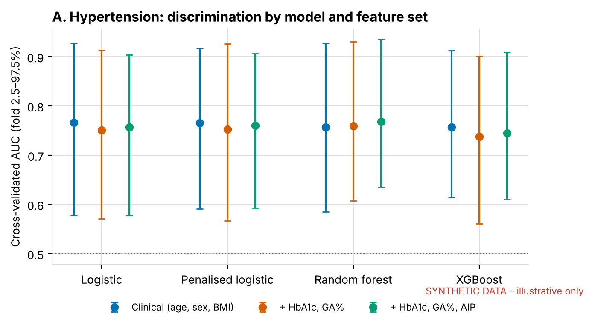
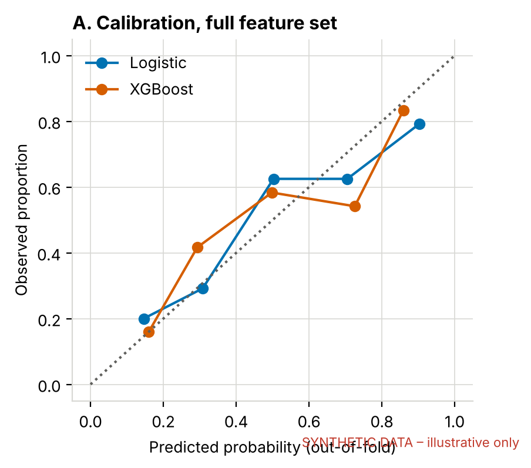
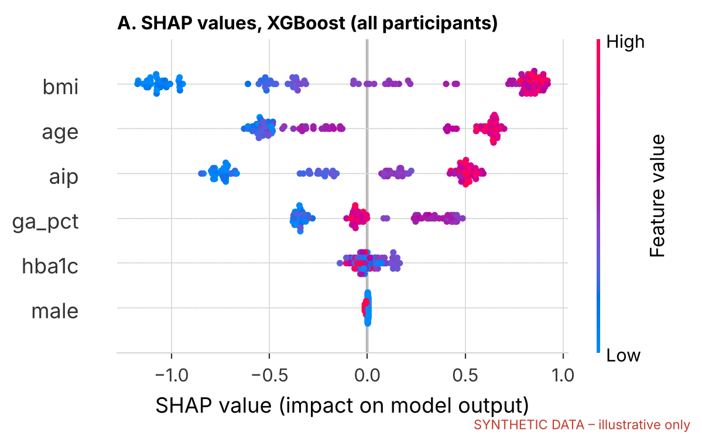
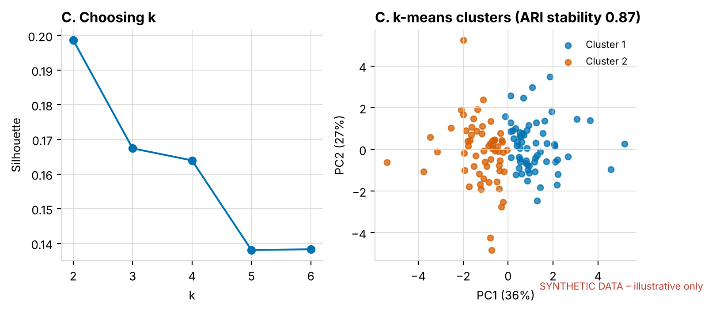

# Small-sample machine learning for cardiometabolic risk in people living with HIV

A machine learning extension of my MSc dissertation, which compares HbA1c and glycated albumin in adults on dolutegravir-based ART (n = 121). See [hba1c-ga-method-agreement](https://github.com/watsonmash/hba1c-ga-method-agreement) for the primary analysis.

The cohort is small, and the point of this repository is to show machine learning done honestly at that scale. That means:

- every model is evaluated out of sample;
- flexible models are compared against a logistic baseline;
- calibration is reported alongside discrimination;
- interpretation comes from both the model and the biology.

**The data here are synthetic.** The real study data are confidential clinical records and are not shared. Figures carry a red watermark, and the numbers in them are not study results.

## Questions

**A. Do glycaemic markers and the Atherogenic Index of Plasma improve prediction of hypertension beyond age, sex and BMI?**
This has the same structure as asking whether a polygenic score adds information to a clinical risk model. We fit a baseline model, add the new predictors, and estimate the change in AUC on held-out data, paired fold by fold.

- **Feature sets:** clinical (age, sex, BMI) → + HbA1c and GA% → + AIP.
- **Models:** logistic regression, penalised logistic regression (L2, with the penalty tuned by inner cross-validation), random forest, and shallow XGBoost.
- **Evaluation:** 10 × 5-fold repeated stratified cross-validation. Metrics are AUC, Brier score, and calibration slope on the out-of-fold predictions.
- **Interpretation:** SHAP values from XGBoost, set against standardised logistic coefficients.

**B. What explains disagreement between the two glycaemic markers?**
The outcome is z(GA%) − z(HbA1c), the signed discordance on a common scale. Predictors are albumin, BMI, age, sex and AIP. We compare linear, ridge and XGBoost regression by repeated cross-validated R², test against a permutation null, and report bootstrap CIs for the coefficients.

HbA1c depends on erythrocyte lifespan and GA% on albumin turnover. If routine covariates explain little of the discordance, the remaining variance points to unmeasured determinants: red-cell indices, haemoglobin variants and, at population scale, genetic variants acting on HbA1c through non-glycaemic pathways.

**C. Are there stable cardiometabolic phenotypes?**
k-means clustering is applied to HbA1c, GA%, AIP, BMI and systolic BP after rank-based normal scoring. Without that step, a handful of extreme values dominate the solution. k is chosen by silhouette and Gaussian-mixture BIC, and stability is measured by bootstrap adjusted Rand index. A cluster that does not reproduce under resampling is not reported as a phenotype.

## Lessons this design shows

1. **Overfitting shows up in calibration before it shows up in AUC.** Unpenalised logistic regression with six predictors and about 60 events gives calibration slopes well below 1. Penalisation brings them back towards 1.
2. **Gradient boosting does not rescue a small sample.** With n ≈ 120, XGBoost rarely beats a regularised linear model, and its fold-to-fold variance is larger.
3. **Incremental value needs a paired comparison.** Overlapping confidence intervals on two AUCs are not a test. The paired ΔAUC across identical folds is.
4. **Clustering always returns clusters.** Bootstrap stability is the minimum evidence that the clusters are real.

## Run it

```bash
pip install -r requirements.txt
python src/make_synthetic_data.py       # data/synthetic_study_data.csv
python src/ml_analysis.py               # outputs/ml_results.xlsx + figures (~3 min)
python src/ml_analysis.py --exclude-qc  # sensitivity: drop physiologically implausible records
```

## Example output (synthetic data)



| Calibration | SHAP |
|---|---|
|  |  |



## Files

- `src/features.py`: loading the data and deriving features (BMI, GA%, AIP, the hypertension definition, discordance, QC flags).
- `src/ml_analysis.py`: analyses A–C.
- `src/make_synthetic_data.py`: a parametric synthetic data generator that uses no real records.

## Author

Watson Mashandudze, clinical biochemist and MSc Clinical Biochemistry candidate, University of Zimbabwe. GCI World Data Science certificate, Matsuo–Iwasawa Laboratory, University of Tokyo (2026).

Licence: MIT (code only).
